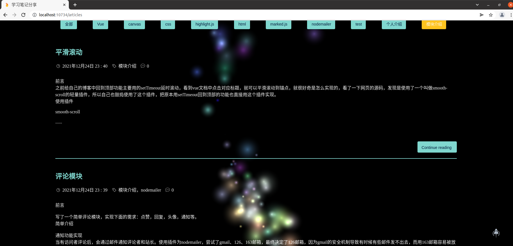
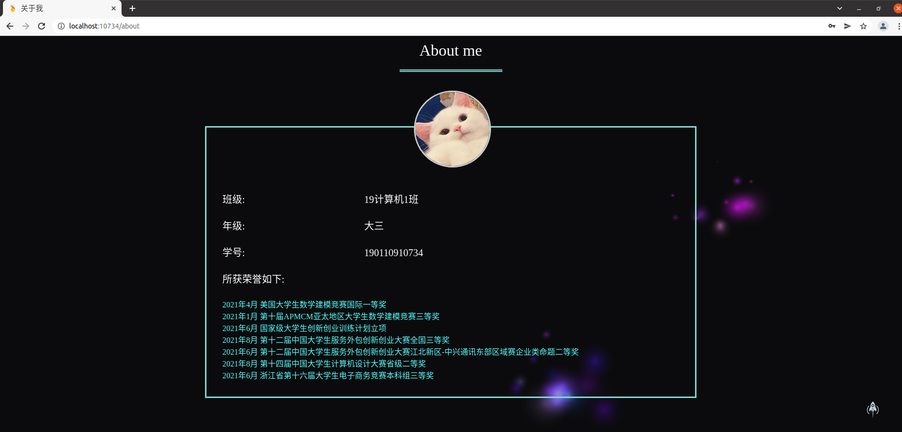

# 开源期末大作业——个人博客系统

作者：杨聪聪

班级：19计算机1

学号：190110910734

# 项目设计使用说明书

github地址：https://github.com/ycc123456789/-/tree/master

运行方式：

连接数据库：mongod --dbpath  /home----

打开终端输入：npm run start & npm run dev

项目系统就会自动运行在：http://localhost:10734/

## 项目设计部分

### 1)项目总体构成

项目总共分为两个子系统，**前端的博客系统**和**后端的管理系统**。

在前端的博客系统中有四个界面，分别是**“首页”，“博客”，“联系站长”，“关于我”**。

其中，**首页**显示最近更新的博客，以及发送邮件的界面

通过上方搜索框可以搜索需要查找的文章，最底下有github网站和vue的教程网站，发送邮件可以直接发送到我的邮箱里1941933541@qq.com。

（首页图片个人爱好，好看🐶，嘿嘿）

其次，第二个界面是**博客**，这是该系统的主要界面，里面包含所有的博客文章。

对于每一篇博客文章，都可以搜索查询，每一篇博客都有展示在下拉列表中，显示标题和主要内容等信息，供读者寻找阅读。

对任意一篇博客，点击进去都有详细介绍，有些包含代码和介绍，有些包含文章和算法。

最底下可以发表自己的评论，可以和作者进行交流，具有回复功能。

第三个界面是联系界面，该界面可以发送邮件直接联系到我的邮箱（看似简单的功能实现复杂啊）

最后一个界面是对我自己的介绍（那肯定是狠狠夸自己，搬上来第二学年部分获奖，希望老师给个高分哈哈！）

接下来就是介绍第二个子系统

需要点击最下面的站长登陆，登陆账号为：**boss**，登陆密码为：**123456**

登陆界面如下：

同样登陆之后有四个界面，分别是**“文章”，“搜索”，“草稿”，“账户”**

第一个界面是最主要的查看和修改博客的界面

可以进行文章的增删改，发表新文章

第二个界面是搜索界面，可以通过标题，标签和日期三种方式进行搜索哦

第三个界面是草稿，用于保存还没写完的草稿博客文章

最后一个界面是修改自己的登陆密码

### 2）项目目录结构和各个部分的说明

│  .babelrc             babel配置
│  .editorconfig        编辑器配置
│  .eslintignore       
│  .eslintrc.js         eslintrc配置
│  .gitignore           git上传
│  .postcssrc.js
│  debug.log
│  index.html           打包模板
│  package.json
├─build               部署运行
│
├─server           服务端功能实现
│      │
│      ├─ api           接口函数
│      │
│      ├─ db            数据库
│      │
│      ├─ middlewares   中间件
│      │
│      ├─app.js
│      └─email.js      发送邮件
│
├─src
│   │  main.js        项目入口
│   │  App.vue          根组件
│   │
│   ├─assets          外部引用文件
│   │  ├─css          好看就行
│   │  └─js
│   │
│   ├─components      vue组件
│   │  ├─back         后端管理系统组件
│   │  ├─front        前端博客系统组件
│   │  └─share        共享组件
│   │
│   ├─ lib
│   │
│   ├─router          路由
│   │
│   └─store           vuex文件
│
└─static            静态文件照片

## 使用说明书

本节列举了10个主要的功能（琐碎小功能不展示了）

#### 1）搜索博客

#### 2）发送邮件

#### 3）浏览博客，阅读博客

#### 4）发表评论

#### 5）登陆后台管理系统

#### 6）删改博客文章

#### 7)增加博客文章

#### 8）博客文章草稿操作

#### 9）通过标题，标签和日期进行搜索查看

#### 10）修改密码

## 开发日记

在这次大作业中，我参考了许多github的作品，最终选择了一个模板进行制作，前前后后花费了两周的时间，感受颇深，体会到一个系统完成的不容易，但是也非常的有成就感，和上学期的web课大作业一样，虽然从jsp和sql换成了nodejs和mongodb，制作一个系统的总思路和总流程是一样的。作为一个大三的学生了，在未来，我相信我会越来越强，我也会继续不断的提升自己。

第一次提交：

我测试使用github仓库，以及摸索如何提交，保证提交不会出现失误。在测试完成后我新建了空文件夹，包括系统代码和项目设计开发说明书。git的提交流程为git init——git add .——git commit -m 'first commit'——git remote add origin https://github.com/ycc123456789/-/tree/master——git pull --rebase origin master——git push -u origin master。

第二次提交：

先理清除需要创建的数据库表和各自之间的关系，创建数据库的表，总共三张，分别为：用户表，文章表和评论表，其中用户表有三个属性：姓名，密码和状态；文章表有类型，标题，内容，标签，日期，是否公开和评论7个属性；评论表有七个属性：图片名，评论名，地址，内容，文章编号，日期，标签；并插入内容。然后引入外部的css和js文件，用于前端的制作。

第三次提交：

进行博客系统的制作，因为博客系统不需要设计大量数据库的增删改查，比较容易，制作系统的前后端，对前端将界面进行设计，排布美化，实现粒子效果，并实现博客交互，测试功能。前端采用vue框架，博客系统的代码在src/compnents/front下，共有7个界面：关于我、博客文章预览、文章详细界面、联系作者、主页、粒子效果界面、搜索界面。

第四次提交：

继续完成第一个子系统，完成邮件发送功能和搜索查询功能，进行经一步排布美化界面。之后，开始制作第二个管理系统，与数据库连接，制作登陆界面和修改密码界面。与数据库的连接以及一系列增删改查均在server文件夹中，邮件的发送在email.js中，数据库的插入与设计在db子文件夹下，两个系统的数据库操作均在api子文件夹下。而第二个管理系统中的前端页面总共有7个，分别是登陆、修改密码、搜索、草稿管理、新建草稿、博客管理、新建博客。

第五次提交：

完成博客的搜索与增删改，博客的创建以及草稿的保存，实现登出并美化界面，实现搜索的细分，通过标签标题和日期进行搜索。添加第一个子系统底部链接，链接跳转到我的github仓库。

第六次提交：

设置运行和配置运行环境。运行方式为：首先打开终端输入运行mongodb数据库，然后再输入npm run start & npm run dev，即可自动打开localost:10734网站进入系统。

第七次提交：

撰写项目设计使用说明书和开发日记。

第八次提交：

进一步细化改善系统。

之后的提交：

也是进一步改善系统。

